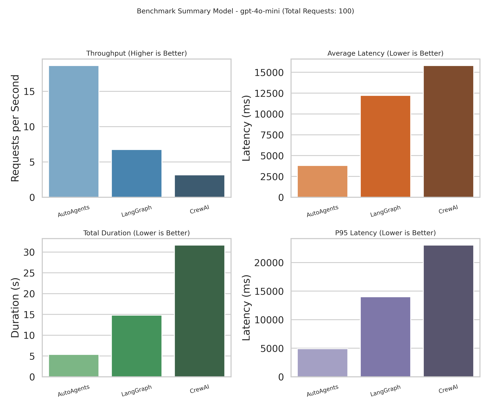

## AutoAgents Benchmark

Concurrent completion benchmarks for the `autoagents` framework alongside LangGraph and CrewAI agents.

All runners read their workload settings from `benchmark.yaml` (or a path provided via `BENCH_CONFIG`). Update that file to change request count, concurrency, model, or prompt template once and share it across languages.

All runners require an `OPENAI_API_KEY` that can call the configured models.

### Disclaimer
The benchmarks are written in Rust and Python. The Rust benchmarks use the `autoagents` framework, while the Python benchmarks use LangGraph and CrewAI agents. The benchmarks are designed to measure the performance of these agents in processing large amounts of data. If you feel like the benchmarks are not accurate or you have any suggestions, please feel free to open an issue or submit a pull request.

---

### Benchmark
The below bencmark is run for 250 parallel requests to process an ReAct Style Agent to process and parquet file to calculate the average duration time.


---

The below bencmark is run for 100 parallel requests to process an ReAct Style Agent to process and parquet file to calculate the average duration time. In this we use structured_output from the agent to evaluate if the generated value is correct or not.



---

### Rust benchmark (AutoAgents)

```shell
export OPENAI_API_KEY=sk-your-key

cargo run --release
```

### Python benchmark (LangGraph, CrewAI)

```shell
export OPENAI_API_KEY=sk-your-key

# Using uv (recommended) or your preferred Python runner
uv run main.py
```

### Note

Python Files are in `_src` folder and Rust in `src`

### TODO
- [x] Bench 300 for AutoAgents
- [ ] Need to run 300 bench for langgraph and crewai
- [ ] Add Memory in the benchmark
